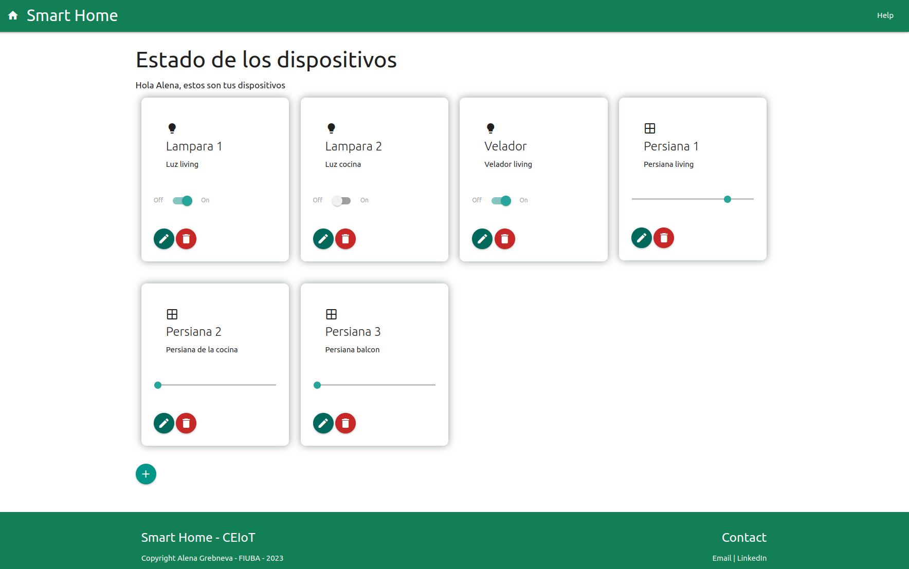

<a href="https://www.gotoiot.com/">
    
</a>

Web App Full Stack - CEIoT 8Co23
=======================

Este proyecto es una aplicación web fullstack basada en la [Web App Full Stack Base](https://github.com/mramos88/app-fullstack-base-2023-i08) provista en la cátedra de Desarrollo de Aplicaciones Web para la [Carrera de Especialización en Internet de las Cosas](https://lse.posgrados.fi.uba.ar/posgrados/especializaciones/internet-de-las-cosas) de la Universidad de Buenos Aires.

La aplicación se ejecuta sobre el ecosistema `Docker`. Está compuesta por un compilador de `TypeScript` que permite utilizar este superset de JavaScript para poder programar un `cliente web` como una una *Single Page Application* (SPA). También tiene un servicio en `NodeJS` que permite ejecutar código en backend y al mismo tiempo disponibilizar el código del cliente web para interactar con el servicio. Además tiene una `base de datos` MySQL que puede interactuar con el backend para guardar y consultar datos. La base de datos trae un `administrador` de base de datos para poder administrarla, en caso de que sea necesario.

La aplicación IoT que viene con este proyecto se encarga de crear dos tablas (`Devices` y `Users`) en la base de datos y también crea algunos dispositivos y usuarios de ejemplo. Asimismo, la aplicación contiene código de backend y frontend para controlar, desde un navegador web, el estado de los dispositivos de un hogar inteligente (en este caso se definen dos tipos a modo de ejemplo: lámpara y persiana) y almacenar los estados de cada uno en la base de datos. 

En esta imagen podés ver una posible implementación del cliente web que controla los artefactos del hogar:



## Comenzando 🚀

Esta sección es una guía con los pasos escenciales para que puedas poner en marcha la aplicación.

<details><summary><b>Mira los pasos necesarios</b></summary><br>

### Instalar las dependencias

Para correr este proyecto es necesario que instales `Docker` y `Docker Compose`. 

En [este artículo](https://www.gotoiot.com/pages/articles/docker_installation_linux/) publicado en nuestra web están los detalles para instalar Docker y Docker Compose en una máquina Linux. Si querés instalar ambas herramientas en una Raspberry Pi podés seguir [este artículo](https://www.gotoiot.com/pages/articles/rpi_docker_installation) de nuestra web que te muestra todos los pasos necesarios.

En caso que quieras instalar las herramientas en otra plataforma o tengas algún incoveniente, podes leer la documentación oficial de [Docker](https://docs.docker.com/get-docker/) y también la de [Docker Compose](https://docs.docker.com/compose/install/).

Continua con la descarga del código cuando tengas las dependencias instaladas y funcionando.

### Descargar el código

Para descargar el código, lo más conveniente es que realices un `fork` de este proyecto a tu cuenta personal haciendo click en [este link](https://github.com/gotoiot/app-fullstack-base/fork). Una vez que ya tengas el fork a tu cuenta, descargalo con este comando (acordate de poner tu usuario en el link):

```
git clone https://github.com/USER/app-fullstack-base.git
```

> En caso que no tengas una cuenta en Github podes clonar directamente este repo.

### Ejecutar la aplicación

Para ejecutar la aplicación tenes que correr el comando `docker-compose up` desde la raíz del proyecto. Este comando va a descargar las imágenes de Docker de node, de typescript, de la base datos y del admin de la DB, y luego ponerlas en funcionamiento. 

Para acceder al cliente web ingresa a a la URL [http://localhost:8000/](http://localhost:8000/) y para acceder al admin de la DB accedé a [localhost:8001/](http://localhost:8001/). 

Si pudiste acceder al cliente web y al administrador significa que la aplicación se encuentra corriendo bien. 

> Si te aparece un error la primera vez que corres la app, deteńe el proceso y volvé a iniciarla. Esto es debido a que el backend espera que la DB esté creada al iniciar, y en la primera ejecución puede no alcanzar a crearse. A partir de la segunda vez el problema queda solucionado.

</details>

Continuá explorando el proyecto una vez que lo tengas funcionando.

## Configuraciones de funcionamiento 🔩

Al crearse la aplicación se ejecutan los contenedores de Docker de cada servicio, se crea la base de datos y sus tablas. A continuación podés encontrar info si querés cambiar la estructura de la DB o bien sus configuraciones de acceso.

<details><summary><b>Lee cómo configurar la aplicación</b></summary><br>

### Configuración de la DB

Como ya comprobaste, para acceder PHPMyAdmin tenés que ingresar en la URL [localhost:8001/](http://localhost:8001/). En el login del administrador, el usuario para acceder a la db es `root` y contraseña es la variable `MYSQL_ROOT_PASSWORD` del archivo `docker-compose.yml`.

Para el caso del servicio de NodeJS que se comunica con la DB fijate que en el archivo `src/backend/mysql-connector.js` están los datos de acceso para ingresar a la base.

Si quisieras cambiar la contraseña, puertos, hostname u otras configuraciones de la DB deberías primero modificar el servicio de la DB en el archivo `docker-compose.yml` y luego actualizar las configuraciones para acceder desde PHPMyAdmin y el servicio de NodeJS.

### Estructura de la DB

Al iniciar el servicio de la base de datos, si esta no está creada toma el archivo que se encuentra en `db/dumps/smart_home.sql` para crear la base de datos automáticamente.

En ese archivo está la configuración de la tabla `Devices` y otras configuraciones más. Si quisieras cambiar algunas configuraciones deberías modificar este archivo y crear nuevamente la base de datos para que se tomen en cuenta los cambios.

Tené en cuenta que la base de datos se crea con permisos de superusuario por lo que no podrías borrar el directorio con tu usuario de sistema, para eso debés hacerlo con permisos de administrador. En ese caso podés ejecutar el comando `sudo rm -r db/data` para borrar el directorio completo.

</details>


## Detalles principales 🔍

En esta sección vas a encontrar las características más relevantes del proyecto.

<details><summary><b>Mira los detalles más importantes de la aplicación</b></summary><br>
<br>

### Arquitectura de la aplicación

Como ya pudiste ver, la aplicación se ejecuta sobre el ecosistema Docker, y en esta imagen podés ver el diagrama de arquitectura.


### El cliente web

El cliente web es una Single Page Application que se comunica con el servicio en NodeJS mediante JSON a través de requests HTTP. Puede consultar el estado de dispositivos en la base de datos (por medio del servicio en NodeJS) y también cambiar el estado de los mismos. Los estilos del código están basados en **Material Design**.

### El servicio web

El servicio en **NodeJS** posee distintos endpoints para comunicarse con el cliente web mediante requests HTTP enviando **JSON** en cada transacción. Procesando estos requests es capaz de comunicarse con la base de datos para consultar y controlar el estado de los dispositivos, y devolverle una respuesta al cliente web también en formato JSON. Así mismo el servicio es capaz de servir el código del cliente web.

### La base de datos

La base de datos se comunica con el servicio de NodeJS y permite almacenar el estado de los dispositivos en la tabla **Devices**. Ejecuta un motor **MySQL versión 5.7** y permite que la comunicación con sus clientes pueda realizarse usando usuario y contraseña en texto plano. En versiones posteriores es necesario brindar claves de acceso, por este motivo la versión 5.7 es bastante utilizada para fases de desarrollo.

### El administrador de la DB

Para esta aplicación se usa **PHPMyAdmin**, que es un administrador de base de datos web muy utilizado y que podés utilizar en caso que quieras realizar operaciones con la base, como crear tablas, modificar columnas, hacer consultas y otras cosas más.

### El compilador de TypeScript

**TypeScript** es un lenguaje de programación libre y de código abierto desarrollado y mantenido por Microsoft. Es un superconjunto de JavaScript, que esencialmente añade tipos estáticos y objetos basados en clases. Para esta aplicación se usa un compilador de TypeScript basado en una imagen de [Harmish](https://hub.docker.com/r/harmish) en Dockerhub, y está configurado para monitorear en tiempo real los cambios que se realizan sobre el directorio **src/frontend/ts** y automáticamente generar código compilado a JavaScript en el directorio  **src/frontend/js**. Los mensajes del compilador aparecen automáticamente en la terminal al ejecutar el comando **docker-compose up**.

### Ejecución de servicios

Los servicios de la aplicación se ejecutan sobre **contenedores de Docker**, así se pueden desplegar de igual manera en diferentes plataformas. Los detalles sobre cómo funcionan los servicios los podés ver directamente en el archivo **docker-compose.yml**.

### Organización del proyecto

En la siguiente ilustración podés ver cómo está organizado el proyecto para que tengas en claro qué cosas hay en cada lugar.

```sh
├── db                          # directorio de la DB
│   ├── data                    # estructura y datos de la DB
│   └── dumps                   # directorio de estructuras de la DB
│       └── smart_home.sql      # estructura con la base de datos "smart_home"
├── doc                         # documentacion general del proyecto
└── src                         # directorio codigo fuente
│   ├── backend                 # directorio para el backend de la aplicacion
│   │   ├── index.js            # codigo principal del backend
│   │   ├── mysql-connector.js  # codigo de conexion a la base de datos
│   │   ├── package.json        # configuracion de proyecto NodeJS
│   │   └── package-lock.json   # configuracion de proyecto NodeJS
│   └── frontend                # directorio para el frontend de la aplicacion
│       ├── js                  # codigo javascript que se compila automáticamente
│       ├── static              # donde alojan archivos de estilos, imagenes, fuentes, etc.
│       ├── ts                  # donde se encuentra el codigo TypeScript a desarrollar
│       └── index.html          # archivo principal del cliente HTML
├── docker-compose.yml          # archivo donde se aloja la configuracion completa
├── README.md                   # este archivo
├── CHANGELOG.md                # archivo para guardar los cambios del proyecto
├── LICENSE.md                  # licencia del proyecto
```

> No olvides ir poniendo tus cambios en el archivo `CHANGELOG.md` a medida que avanzas en el proyecto.

</details>

## Detalles de implementación 💻

En esta sección podés ver los detalles específicos de funcionamiento del código y que son los siguientes.

<details><summary><b>Mira los detalles de implementación</b></summary><br>

**Tipos de dispositivos**

La aplicación soporta 2 tipos de dispositivos:
1. Luces
2. Persianas

Los dispositivos del tipo 1 poseen un switch para encenderlos o apagarlos, los del tipo 2 poseen un slider para establecer su valor de estado que representa el porcentaje de apertura o cierre (0% - completamente cerrado; 100% - completamente abierto).

### Agregar un dispositivo

Para agregar un dispositivo desde el cliente web se debe acceder a la aplicación mediante la URL: http://localhost:8000/.

1. Si es la primera vez que ingresa, se deberá crear un usuario nuevo haciendo click sobre el botón con el ícono "+" y luego completando todos los datos solicitados (no se podrá cargar un usuario nuevo si no se introducen todos los datos).


2. Para acceder al panel de dispositivos se deberá introducir un usuario y contraseña (si no se introduce usuario o contraseña, se desplegará un *toast* indicando que se requieren completar todos los datos).


3. Desde esta pantalla, se debe hacer click en el botón con el signo "+" en la parte inferior de la grilla. Esta acción abrirá un *modal* para la creación de un nuevo dispositivo, donde se deberán introducir todos los datos (en caso de no completarlos se desplegará un *toast* indicando que se requieren completar todos los datos).


4. También es posible eliminar dispositivos o modificar sus parámetros mediante los botones inferiores de cada panel. 
* Al hacer click en el botón "Eliminar" se despliega un modal para confirmar la acción donde se muestran los datos del dispositivo.


* Al hacer click en el botón "Editar" se despliega un modal similar al que se muestra para agregar un dispositivo nuevo, donde se podrán editar los parámetros del dispositivo.


### Frontend

El frontend fue desarrollado con TypeScript. 

En la clase *Main* se implementan los métodos necesarios para gestionar las acciones solicitadas por el usuario desde la pagina web. La implementación del *event listener* permite que las acciones que el usuario realiza en la interfaz (por ejemplo, presionar un botón) tengan un nexo con el código del *Main*. Esto habilita las siguientes funcionalidades:
    
1. Autenticación mediante usuario y contraseña al panel de control
2. Crear un nuevo usuario
3. Listar todos los dispositivos creados en una grilla mediante *cards*
4. Crear un nuevo dispositivo
5. Modificar el estado de un dispositivo
6. Editar un dispositivo existente    
7. Eliminar un dispositivo existente 

Las validaciones de los datos de usuario y dispositivos se realiza tanto en el frontend como en el backend.    
    
Al ejecutar cada una de estas funcionalidades, el frontend realiza llamadas HTTP al backend para poder obtener el resultado esperado y en algunos casos se emitirá un mensaje tipo *toast* para informar al usuario si la operación tuvo éxito o falla. 

En la clase *Framework* se definen los métodos necesarios para delegar todas las peticiones (*GET*, *POST*, *PUT* y *DELETE*) al backend y gestiona las alertas relacionadas con estas peticiones.

### Backend

Las tecnologías utilizadas para el desarrollo del backend son NodeJS utilizando ExpressJS.

Los datos se almacenan en una base de datos MySQL persistente con las siguientes tablas:
1. Users:
    *   id: identificador único de cada usuario.
    *   username: nombre del usuario.
    *   password: contraseña del usuario.

> NOTA (punto a mejorar): no se recomienda almacenar contraseñas directamente en la base de datos. Se recomienda utilizar técnicas de encriptación para almacenar y verificar las contraseñas de forma segura.

2. Devices:
    *   id: identificador único de cada dispositivo.
    *   name: nombre del dispositivo.
    *   description: descripción del dispositivo.
    *   state: estado actual del dispositivo (0/1 para lámpara, 0 a 100 para persiana).
    *   type: tipo de dispositivo (1 para lámpara, 2 para persiana).
    
En el archivo *index.js* que se encuentra en la raíz de la carpeta "backend" están definidos los parámetros de conexión a la base de datos y los *endpoints* de los dispositivos. Esto permite efectuar las siguientes acciones:
1. Validar un usuario por el *username* y *password*
2. Crear un usuario nuevo
3. Obtener todos los dispositivos
4. Obtener los datos de un dispositivo por su ID
5. Crear un un dispositivo nuevo
6. Modificar los datos de un dispositivo
7. Actualizar el estado de un dispositivo
8. Eliminar un dispositivo

Cada endpoint hace una validación inicial de y devuelve al frontend los siguientes códigos, junto con un mensaje descriptivo:
* 400: error de comunicación a la base de datos u otro tipo de error según la operación
* 401: usuario no existente
* 200: operación realizada con éxito
* 201: dato insertado a la base de datos con éxito

<details><summary><b>Ver los endpoints disponibles</b></summary><br>
1. Endpoint para validar el login de un usuario.
    
    URL: http://localhost:8000/users/login

```json
{
    "method": "post",
    "request_headers": "application/json",
    "response_code": 200,
    "username": "exampleuser",
    "password": "examplepassword"
}
```

Query SQL empleada:    
```sql
    SELECT * FROM `Users` WHERE username = ? AND password = ?
```

    El *status code* de respuesta en caso de éxito será 200, con el mensaje "Ok". 
    En caso de que la operación falle el *status code* de respuesta será 401, con el mensaje "Error". 

2. Endpoint para crear un usuario nuevo.

    URL: http://localhost:8000/users/

```json
{
    "method": "post",
    "request_headers": "application/json",
    "response_code": 200,
    "username": "exampleuser",
    "password": "examplepassword",
    "type": "1"
}
```

Query SQL empleada:    
```sql
    INSERT INTO `Users` (`username`, `password`, `type`) VALUES (?, ?, ?)
```
    
    El *status code* de respuesta en caso de éxito será 201, con el mensaje "Usuario creado correctamente". 
    En caso de que la operación falle el *status code* de respuesta será 400. 


3. Endpoint para obtener todos los dispositivos.
    
    URL: http://localhost:8000/devices
    Content-Type: application/json

```json
{
    "method": "get",
    "request_headers": "application/json",
    "response_code": 200,
    "request_response": [
            {"id":1,"name":"Lampara 1","description":"Luz living","state":1,"type":1},
            {"id":2,"name":"Lampara 2","description":"Luz cocina","state":0,"type":1},
            ...
            {"id":7,"name":"Velador 2","description":"Velador de la habitación.","state":0,"type":1}
        ]
}
```

Query SQL empleada:    
```sql
    SELECT * FROM Devices
```
    
    El *status code* de respuesta en caso de éxito será 200. 
    En caso de que la operación falle el *status code* de respuesta será 400. 
    
4. Endpoint para obtener un dispositivo específico a partir de su ID.

    URL: http://localhost:8000/devices/:id
    Ejemplo: http://localhost:8000/devices/2

```json
{
    "method": "get",
    "request_headers": "application/json",
    "response_code": 200,
    "request_response": {"id":2,"name":"Lampara 2","description":"Luz cocina","state":0,"type":1},
}
```

Query SQL empleada:
```sql
    SELECT * FROM Devices WHERE id = ?
```
    El *status code* de respuesta en caso de éxito será 200. 
    En caso de que la operación falle debido a que el dispositivo no existe u otro motivo, el *status code* de respuesta será 400.
    
5. Endpoint para crear un nuevo dispositivo.
    URL: http://localhost:8000/devices

```json
{
    "method": "post",
    "request_headers": "application/json",
    "response_code": 200,
    "payload": {"name": "Example", "description": "Example", "type": 1, "state": 0},
    "request_response": {"id": 8},
}
```

Query SQL empleada:    
```sql
    INSERT INTO `Devices` (`name`, `description`, `state`, `type`) VALUES (?, ?, ?, ?)
```
    
    El *status code* de respuesta en caso de éxito será 201. 
    En caso de que la operación falle debido a que el dispositivo no existe u otro motivo, el *status code* de respuesta será 400.
    
6. Endpoint para modificar un dispositivo específico a partir de su ID.

   URL: http://localhost:8000/devices/:id
   Ejemplo: http://localhost:8000/devices/8

```json
{
    "method": "put",
    "request_headers": "application/json",
    "response_code": 200,
    "payload": { "id": 8, "name": "Example", "description": "Example", "type": 2, "state": 0 },
    "request_response": {"changedRows": 1},
}
```

Query SQL empleada:    
```sql
    UPDATE `Devices` SET `name` = ?, `description` = ? , `type` = ? WHERE `id` = ?
```

    El *status code* de respuesta en caso de éxito será 200. 
    En caso de que la operación falle debido a que el dispositivo no existe u otro motivo, el *status code* de respuesta será 400.

7- Endpoint para cambiar el estado de un dispositivo.
    
    URL: http://localhost:8000/devices/:id
    Ejemplo: http://localhost:8000/devices/8
    
```json
{
    "method": "put",
    "request_headers": "application/json",
    "response_code": 200,
    "payload": { "id": 8, "state": 20 },
    "request_response": {"changedRows": 1},
}
```

Query SQL empleada:    
```sql
    UPDATE `Devices` SET `state` = ? WHERE `id` = ?
```

    El *status code* de respuesta en caso de éxito será 200. 
    En caso de que la operación falle debido a que el dispositivo no existe u otro motivo, el *status code* de respuesta será 400.

8- Endpoint para eliminar un dispositivo específico a partir de su id.
    
    URL: http://localhost:8000devices/:id
    Ejemplo: http://localhost:8000/devices/8
    
```json
{
    "method": "delete",
    "request_headers": "application/json",
    "response_code": 200,
    "request_response": "deleted",
}
```

Query SQL empleada:    
```sql
    DELETE FROM Devices WHERE id = ?
```
    
    El *status code* de respuesta en caso de éxito será 200. 
    En caso de que la operación falle debido a que el dispositivo no existe u otro motivo, el *status code* de respuesta será 400.

</details>

</details>


## Tecnologías utilizadas 🛠️

En esta sección podés ver las tecnologías más importantes utilizadas.

<details><summary><b>Mira la lista completa de tecnologías</b></summary><br>

* [Docker](https://www.docker.com/) - Ecosistema que permite la ejecución de contenedores de software.
* [Docker Compose](https://docs.docker.com/compose/) - Herramienta que permite administrar múltiples contenedores de Docker.
* [Node JS](https://nodejs.org/es/) - Motor de ejecución de código JavaScript en backend.
* [MySQL](https://www.mysql.com/) - Base de datos para consultar y almacenar datos.
* [PHPMyAdmin](https://www.phpmyadmin.net/) - Administrador web de base de datos.
* [Material Design](https://material.io/design) - Bibliotecas de estilo responsive para aplicaciones web.
* [TypeScript](https://www.typescriptlang.org/) - Superset de JavaScript tipado y con clases.

</details>

## Contribuir 🖇️

Si estás interesado en el proyecto y te gustaría sumar fuerzas para que siga creciendo y mejorando, podés abrir un hilo de discusión para charlar tus propuestas en [este link](https://github.com/gotoiot/app-fullstack-base/issues/new). Así mismo podés leer el archivo [Contribuir.md](https://github.com/gotoiot/gotoiot-doc/wiki/Contribuir) de nuestra Wiki donde están bien explicados los pasos para que puedas enviarnos pull requests.

## Sobre Goto IoT 📖

Goto IoT es una plataforma que publica material y proyectos de código abierto bien documentados junto a una comunidad libre que colabora y promueve el conocimiento sobre IoT entre sus miembros. Acá podés ver los links más importantes:

* **[Sitio web](https://www.gotoiot.com/):** Donde se publican los artículos y proyectos sobre IoT. 
* **[Github de Goto IoT:](https://github.com/gotoiot)** Donde están alojados los proyectos para descargar y utilizar. 
* **[Comunidad de Goto IoT:](https://groups.google.com/g/gotoiot)** Donde los miembros de la comunidad intercambian información e ideas, realizan consultas, solucionan problemas y comparten novedades.
* **[Twitter de Goto IoT:](https://twitter.com/gotoiot)** Donde se publican las novedades del sitio y temas relacionados con IoT.
* **[Wiki de Goto IoT:](https://github.com/gotoiot/doc/wiki)** Donde hay información de desarrollo complementaria para ampliar el contexto.

## Muestas de agradecimiento 🎁

Si te gustó este proyecto y quisieras apoyarlo, cualquiera de estas acciones estaría más que bien para nosotros:

* Apoyar este proyecto con una ⭐ en Github para llegar a más personas.
* Sumarte a [nuestra comunidad](https://groups.google.com/g/gotoiot) abierta y dejar un feedback sobre qué te pareció el proyecto.
* [Seguirnos en twitter](https://github.com/gotoiot/doc/wiki) y dejar algún comentario o like.
* Compartir este proyecto con otras personas.

## Autores 👥

Las colaboraciones principales fueron realizadas por:

* **[Agustin Bassi](https://github.com/agustinBassi)**: Ideación, puesta en marcha y mantenimiento del proyecto.
* **[Ernesto Giggliotti](https://github.com/ernesto-g)**: Creación inicial del frontend, elección de Material Design.
* **[Brian Ducca](https://github.com/brianducca)**: Ayuda para conectar el backend a la base de datos, puesta a punto de imagen de Docker.

También podés mirar todas las personas que han participado en la [lista completa de contribuyentes](https://github.com/###/contributors).

## Licencia 📄

Este proyecto está bajo Licencia ([MIT](https://choosealicense.com/licenses/mit/)). Podés ver el archivo [LICENSE.md](LICENSE.md) para más detalles sobre el uso de este material.

---

**Copyright © Goto IoT 2021** ⌨️ [**Website**](https://www.gotoiot.com) ⌨️ [**Group**](https://groups.google.com/g/gotoiot) ⌨️ [**Github**](https://www.github.com/gotoiot) ⌨️ [**Twitter**](https://www.twitter.com/gotoiot) ⌨️ [**Wiki**](https://github.com/gotoiot/doc/wiki)
